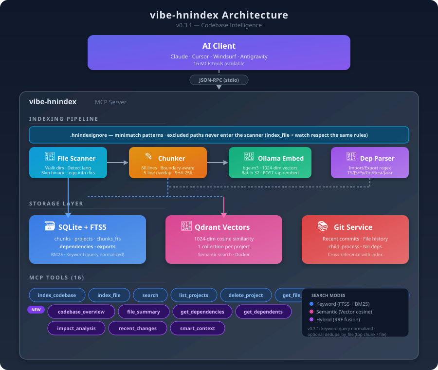

<div align="center">

# vibe-hnindex

**Local MCP server — index your repo once, search it in every AI session**

*Keyword (SQLite FTS5) · Semantic (Qdrant + Ollama embeddings) · Hybrid — your code stays on disk*

[](https://www.npmjs.com/package/vibe-hnindex)
[](https://www.npmjs.com/package/hnindex-cli)
[](LICENSE)
[](https://modelcontextprotocol.io/)
[](https://nodejs.org/)

**MCP server (`vibe-hnindex`) latest: v0.12.0** · [`hnindex-cli`](https://www.npmjs.com/package/hnindex-cli) **v0.12.0** — [Docs](https://docs.hnindex.cloud) · [Changelog](https://hnindex.cloud/changelog) · [GitHub Releases](https://github.com/AndyAnh174/vibe-hnindex/releases)

</div>

---

## What this does

[vibe-hnindex](https://www.npmjs.com/package/vibe-hnindex) is a [Model Context Protocol](https://modelcontextprotocol.io/) server. After you **index** a folder once, assistants (Claude, Cursor, Windsurf, Antigravity, …) can **search** that codebase with paths and line ranges — data is stored locally (SQLite + optional Qdrant). Embeddings use **Ollama**; vectors use **Qdrant** (Docker, local, or [Qdrant Cloud](https://cloud.qdrant.io/) with `QDRANT_API_KEY`).

---

## Documentation

📚 **Full docs site: [docs.hnindex.cloud](https://docs.hnindex.cloud)** — 16 pages covering Getting Started, Configuration, Tools Reference, Guides, and Code Agent.

| Page | What you'll learn |
|------|-------------------|
| [Introduction](https://docs.hnindex.cloud) | What vibe-hnindex does, key features, how it works |
| [Installation](https://docs.hnindex.cloud/getting-started/installation) | Node, Ollama, Qdrant setup + MCP config |
| [Quick Start](https://docs.hnindex.cloud/getting-started/quick-start) | 5-minute walkthrough with CLI + agent skill |
| [Configuration](https://docs.hnindex.cloud/configuration) | All 25+ env vars with embedding model comparison |
| [Search](https://docs.hnindex.cloud/tools/search) | 6 search modes, regex, fuzzy, streaming, cache |
| [Code Agent](https://docs.hnindex.cloud/tools/code-agent) 🆕 | code_session + code_apply with safety scopes |
| [Setup MCP](https://docs.hnindex.cloud/guides/setup-mcp) | Per-platform config (Claude, Cursor, Antigravity, VS Code...) |

Also available in-repo: [docs/getting-started.md](docs/getting-started.md), [docs/configuration.md](docs/configuration.md), [docs/tools-reference.md](docs/tools-reference.md).

---

## CLI installer (`hnindex`)

Optional — writes the MCP JSON for you (merge-safe, same `npx -y vibe-hnindex` block as in the docs):

```bash
npm install -g hnindex-cli

# Setup MCP config
hnindex init --mcp antigravity    # or: claude, cursor, windsurf, vscode, codex
hnindex init --list               # show all targets and paths

# Install AI agent skill (recommended)
hnindex init-skill --target claude    # or: antigravity, cursor, windsurf, vscode
hnindex init-skill --list             # show all skill targets

# Update
hnindex update                    # npm update -g hnindex-cli
```

See **[docs.hnindex.cloud](https://docs.hnindex.cloud)** for full documentation.

---

## Install in 5 steps

1. **Node.js** — v20+ ([nodejs.org](https://nodejs.org/)). On **Windows**, **Node 20 or 22 LTS** is strongly recommended so `npm install` does not need a C++ compiler. See [Troubleshooting → Windows](docs/troubleshooting.md#windows-npm-install) if `npm i vibe-hnindex` fails.
2. **Ollama** — install from [ollama.com](https://ollama.com/), then: `ollama pull bge-m3:567m` and keep `ollama serve` running (or set `OLLAMA_URL` to a remote server).
3. **Qdrant** — for semantic/hybrid search: `docker run -d --name qdrant -p 6333:6333 qdrant/qdrant` (or use Qdrant Cloud). Keyword-only search works without Qdrant.
4. **MCP config** — add the server to your assistant’s MCP settings. Minimal example (self-hosted Qdrant):

```json
{
  "mcpServers": {
    "vibe-hnindex": {
      "command": "npx",
      "args": ["-y", "vibe-hnindex"],
      "env": {
        "OLLAMA_URL": "http://localhost:11434",
        "OLLAMA_MODEL": "bge-m3:567m",
        "QDRANT_URL": "http://localhost:6333",
        "SEARCH_STREAM_ENABLED": "true",
        "CODE_AGENT_ENABLED": "true",
        "CODE_AGENT_SCOPE": "moderate",
        "CHAT_MEMORY_ENABLED": "true"
      }
    }
  }
}
```

5. **Restart** the IDE or assistant, then in chat ask to **index** a path and **search** — see [First steps](docs/getting-started.md#first-steps-in-chat).

For **Qdrant Cloud**, add `QDRANT_API_KEY` and set `QDRANT_URL` to your HTTPS cluster URL — details in [Getting started](docs/getting-started.md).

### Optional rerank (`RERANK_URL`)

Semantic/hybrid search already uses **Ollama** (`OLLAMA_URL`, `OLLAMA_MODEL` e.g. `bge-m3:567m`) for query vectors and **Qdrant** for retrieval. After that, the server can **reorder** the top pool of hits:

- **Without `RERANK_URL`:** reorder by **Qdrant semantic scores** (no extra network service). This is enough for most setups, including when you only run Ollama + Qdrant.
- **With `RERANK_URL`:** POST JSON `{ "query", "documents" }` to your URL; response `{ "scores": number[] }` (same length as `documents`). Use a **small HTTP service** you host that wraps your reranker; Ollama does not expose this contract on `:11434` by default.

**Ollama vs rerank:** pulling a reranker model in Ollama (e.g. `qllama/bge-reranker-v2-m3`) does **not** replace `RERANK_URL`—you still need an adapter service unless you only rely on the built-in Qdrant reorder. See [Configuration → Rerank](docs/configuration.md#optional-rerank).

| Env | Role |
|-----|------|
| `SEARCH_RERANK` | `false` disables post-retrieval reorder entirely (default: enabled). |
| `SEARCH_RERANK_POOL` | Max candidates considered before trim (default `50`). |
| `RERANK_URL` | Full URL of your `{query, documents}` → `{scores}` API (optional). |
| `RERANK_TIMEOUT_MS` | Timeout for that POST (default `15000`). |

### Timeouts

To prevent hanging when Ollama or Qdrant are unresponsive, vibe-hnindex applies timeouts on all external calls. You can tune these via environment variables:

| Env | Default | Controls |
|-----|---------|----------|
| `OLLAMA_TIMEOUT_MS` | `30000` (30s) | Max wait for Ollama `/api/embed` and `/api/tags` calls |
| `QDRANT_TIMEOUT_MS` | `15000` (15s) | Max wait for Qdrant API calls (search, upsert, etc.) |
| `SEARCH_TIMEOUT_MS` | `60000` (60s) | Overall timeout for the entire search operation |

Set any of these to a higher value if you have a slow machine or large dataset. Set to `0` to disable the timeout for that layer (not recommended).

### Google Antigravity

Use the **same** `mcpServers` block as above, but save it in Antigravity’s MCP file:

| | |
|--|--|
| **File** | `mcp_config.json` under **`.gemini/antigravity/`** in your user folder |
| **Windows** | `C:\Users\<your-username>\.gemini\antigravity\mcp_config.json` |
| **macOS / Linux** | `~/.gemini/antigravity/mcp_config.json` |
| **UI** | **⋮** menu → **MCP** → **Manage MCP Servers** → **View raw config** |

Step-by-step: [Integrations → Google Antigravity](docs/integrations.md#google-antigravity).

---

## Features (short)

| | |
|--|--|
| **Search** | 6 modes: keyword (FTS5+BM25), semantic (Qdrant vectors), hybrid (RRF fusion), regex, symbol, auto |
| **Code Agent** | `code_session` — 1 call replaces 5-15 searches. `code_apply` — safe code changes with auto test/lint/typecheck |
| **Chat Memory** 🆕 | Auto-track tool calls, semantic search via Qdrant, persistent AI context across sessions |
| **Streaming** | Parallel keyword+semantic search (~1.5-2× faster), 4-phase progress notifications |
| **Fuzzy Search** | Levenshtein distance auto-corrects typos ("fucntion" → "function") |
| **Smart Context** | Task-aware context: impact analysis, test file detection, similar code patterns |
| **Storage** | SQLite on disk + Qdrant for vectors; 100% local, no cloud required |
| **Indexing** | Incremental (SHA-1 hash), parallel workers (~3-4× faster), watch mode (auto re-index on save), 40+ languages, `.hnindexignore` |
| **Resilience** | Keyword search works without Qdrant or Ollama; graceful degradation |
| **Benchmark** | Built-in `benchmark_search` tool — compare streaming vs non-streaming, all search modes |
| **Multiple Embedding Models** | bge-m3 (default), nomic-embed-text, qwen3-embedding, mxbai-embed-large, and more |

---

## Architecture

<p align="center">
  
</p>

<p align="center">
  <a href="docs/how-it-works.md">How indexing &amp; search work →</a>
</p>

---

## License

MIT — see [LICENSE](LICENSE).

## Contributing

Issues and PRs: [github.com/AndyAnh174/vibe-hnindex](https://github.com/AndyAnh174/vibe-hnindex).

## Contact

**Ho Viet Anh (AndyAnh174)** · [hovietanh147@gmail.com](mailto:hovietanh147@gmail.com) · [GitHub](https://github.com/AndyAnh174)
