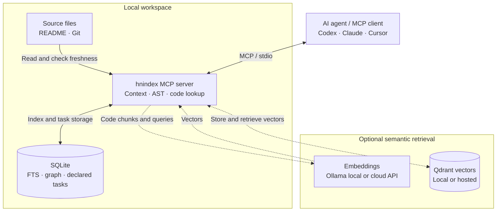
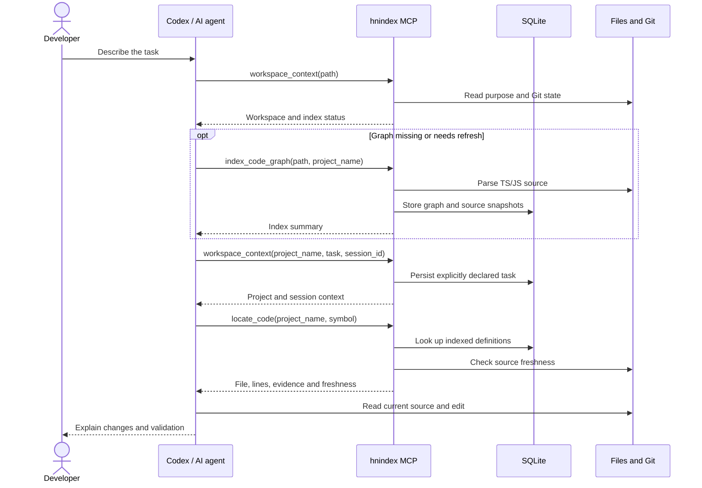
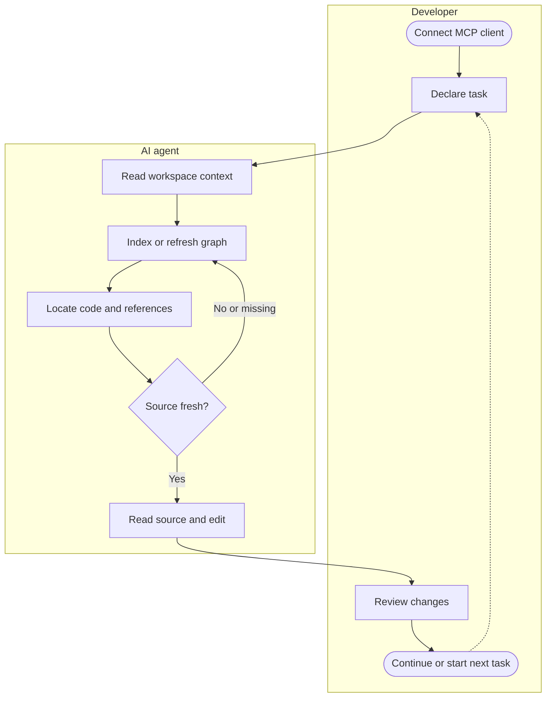

# hnindex architecture

Three views of the same workflow: where context lives, how an agent retrieves it, and how a developer uses it. The offline graph path currently supports TypeScript and JavaScript.[^graph]

## 🏗️ System diagram

The MCP client calls hnindex over stdio. Workspace inspection reads project files and Git; SQLite stores indexed code, graph relationships and declared tasks. Semantic retrieval additionally uses an embedding provider and Qdrant.[^workspace][^graph][^search]

OpenAI, Voyage, Gemini and compatible endpoints receive the chunks/queries sent for embedding. Ollama can run locally. The diagram does not imply that local graph navigation needs either service.[^search]

Graph-only indexing stores graph/source snapshots. FTS keyword chunks and vector indexing are populated separately by `index_codebase`; graph symbol/file navigation still works without them.[^graph]

## 🔄 Sequence diagram

This example starts a task, builds a missing graph, locates a symbol, and checks current files before editing. The client chooses which tools to call; MCP instructions and skills guide that choice.[^workspace][^graph]

Locations are evidence, not permission to edit. Stale or missing results require current filesystem reads and an appropriate index refresh. This sequence uses the offline path.[^workspace]

## 👤 User diagram

The developer connects a client and declares an objective. The agent gathers context and code locations, and the developer reviews the result. A task is stored by project/session, rather than inferred from Git activity.[^workspace][^codex]

Filesystem search remains useful for unsupported languages, excluded files or missing evidence. hnindex narrows navigation; it does not guarantee every client will call a particular tool.[^workspace]

## 📚 Sources

These Mermaid blocks are the canonical source for both websites. Run `npm run content:sync` after editing them; CI checks that the generated copies match.

[^workspace]: [Workspace tools and freshness](https://github.com/AndyAnh174/vibe-hnindex/blob/main/src/services/workspace.ts).
[^graph]: [Code graph implementation](https://github.com/AndyAnh174/vibe-hnindex/blob/main/src/services/code-graph.ts).
[^search]: [Embedding providers and configuration](https://github.com/AndyAnh174/vibe-hnindex/blob/main/docs/configuration.md).
[^codex]: [Official Codex MCP configuration](https://learn.chatgpt.com/docs/extend/mcp?surface=cli). Project `.codex/config.toml` is loaded only for trusted projects.
