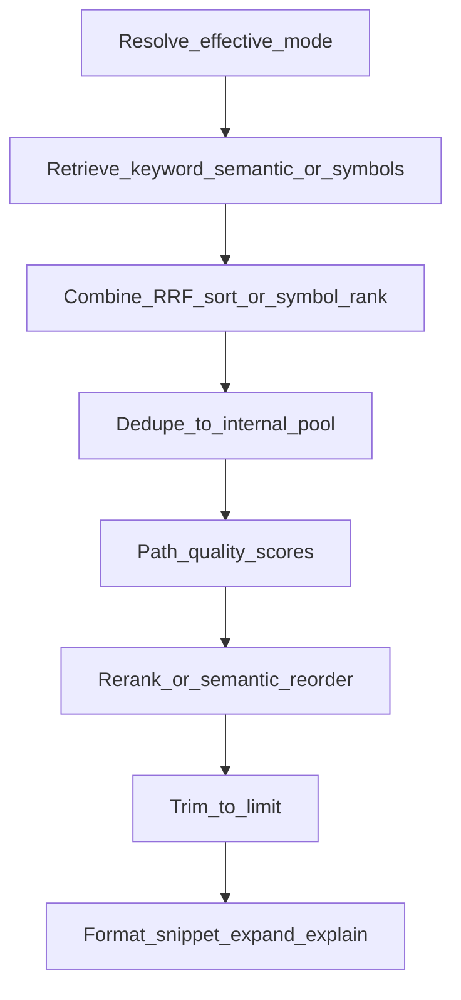

# How it works

## Architecture diagram

<p align="center">
  
</p>

---

## Indexing pipeline

```
Scan directory → filter (40+ extensions; skip node_modules, .git, dist…)
  → SHA-256 hash → skip unchanged files
  → chunk (≈60 lines, boundary-aware, overlap)
  → embed (Ollama bge-m3, batch 32, 1024-dim)
  → SQLite (text + FTS5) + Qdrant (vectors)
```

---

## Hybrid search (RRF)

Keyword and semantic runs are fused with Reciprocal Rank Fusion:

```
score(chunk) = 1/(60 + rank_keyword) + 1/(60 + rank_semantic)
```

Chunks that appear in both lists get higher combined scores.

---

## Search pipeline (query to response)

End-to-end flow for the `search` tool (see [Tools reference](tools-reference.md#search)). Constants and env vars live in [Configuration](configuration.md).

### 1. Resolve effective mode

- If the client omits `mode` and **`SEARCH_AUTO_ROUTE`** is `true`, the effective mode is **`auto`**; otherwise default is **`hybrid`**.
- If the requested mode is **`auto`** (explicitly or via the rule above), **`resolveSearchMode`** in code picks **`keyword`**, **`semantic`**, or **`hybrid`** from the query shape: short path-like queries lean **keyword**; longer or question-like queries lean **hybrid**. See [`src/services/query-router.ts`](../src/services/query-router.ts) and [`tests/query-router.test.ts`](../tests/query-router.test.ts) for exact rules.
- **`symbol`** mode skips FTS/Qdrant and resolves hits from the SQLite **symbols** table only.

### 2. Retrieve candidates

- **Keyword:** SQLite FTS5/BM25 (with optional relaxed OR fallback when strict AND returns nothing).
- **Semantic:** embed the query (Ollama), then Qdrant cosine similarity (skipped if Ollama/Qdrant down; **hybrid** may degrade to keyword-only with a warning).
- **Hybrid:** run both keyword and semantic lists, then **RRF** with **k = 60** (same formula as above). Chunks only in one list still get a non-zero RRF score.
- **Keyword → semantic fallback:** if mode is **keyword**, FTS returned no rows, and **`SEARCH_KEYWORD_FALLBACK_SEMANTIC`** is not `false`, one semantic pass may run when Ollama and Qdrant are healthy.

### 3. Combine and cap pool before scoring adjustments

Depending on branch, results are merged (RRF), sorted by semantic score, or taken from keyword-only. **`dedupe_by_file`** (default on) keeps at most one chunk per file up to an internal **pool** size: when rerank is enabled, the pool is capped by **`SEARCH_RERANK_POOL`** (and `limit`) so more than `limit` candidates can enter the next steps before the final trim.

### 4. Path quality

**`applyPathQualityScores`** multiplies scores for paths matching generated/vendor patterns (e.g. `dist/`, `.next/`, `*.min.js`) by a fixed **0.42**; see [`src/services/path-quality.ts`](../src/services/path-quality.ts). Disabled when **`deprioritize_generated_paths`** is `false`.

### 5. Rerank or reorder

If **`SEARCH_RERANK`** is not `false` and the tool argument **`rerank`** is not `false`, **`rerankSearchResults`** runs:

- With **`RERANK_URL`:** HTTP POST `{ "query", "documents" }` → `{ "scores" }` (same length); on failure or bad payload, falls back to ordering by **Qdrant raw similarity** per chunk when available.
- Without **`RERANK_URL`:** reorder by **semantic raw scores** from Qdrant (no extra service).

If rerank is disabled, this step is skipped.

### 6. Final trim and response formatting

Results are sliced to **`limit`**, then each row is formatted: optional **`expand_context`** (adjacent chunks merged in the snippet), **`content_mode` / `max_content_chars`** truncation, and optional **`explain`** lines (`score_before_path`, `path_multiplier`, RRF/semantic/symbol fields). Ollama is used only for **query embedding** in semantic/hybrid paths—not for this formatting.



---

## Data storage

| Component | Typical location | Role |
|-----------|------------------|------|
| SQLite | `~/.vibe-hnindex/knowledge.db` | Chunks, FTS5, project metadata |
| Qdrant | Docker volume or Cloud | Vectors (cosine, 1024-dim) |

Each project maps to one Qdrant collection: `{QDRANT_COLLECTION_PREFIX}{sanitized_project_name}` (default prefix `mcp_ck_`).

Data persists across IDE sessions and chats until you delete the project.

---

## Supported languages

TypeScript, JavaScript, Python, Java, Go, Rust, C, C++, C#, Ruby, PHP, Swift, Kotlin, Scala, Lua, Bash, SQL, Vue, Svelte, HTML, CSS, SCSS, YAML, TOML, JSON, XML, Markdown, Protobuf, GraphQL, Terraform, Zig, Elixir, Erlang, Clojure, Haskell, OCaml, F#, Dart, Solidity, CMake, Gradle, Dockerfile, Makefile, and more.

**Skipped by default:** `node_modules`, `.git`, `dist`, `build`, `__pycache__`, `vendor`, lockfiles, binaries, files larger than `MAX_FILE_SIZE`.

---

[← Back to docs index](README.md)
